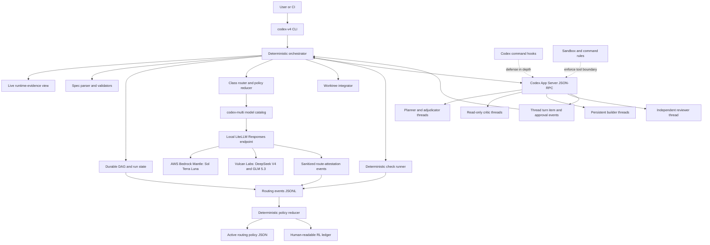
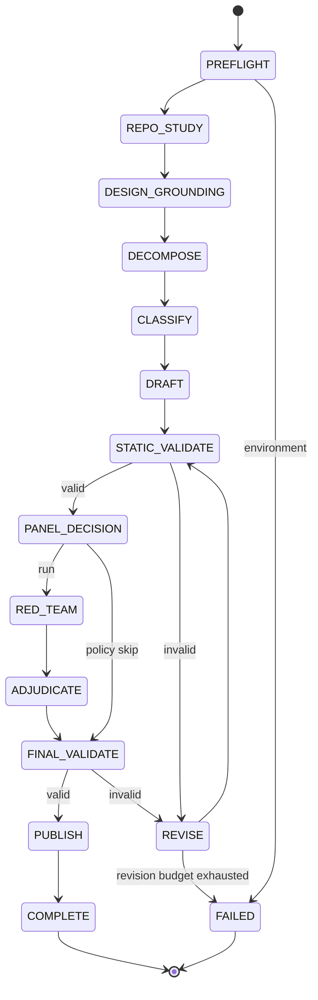
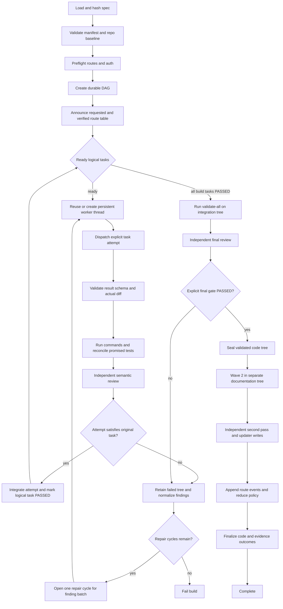
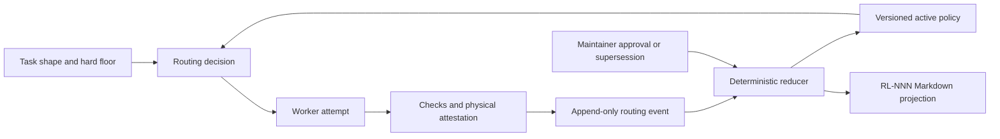

# Codex-Native v4 Planning and Build Orchestration

> **Status:** Revised implementation plan — review accepted and integrated
> **Last Updated:** 2026-09-09
> **Target Runtime:** Codex App Server with the `codex-multi` LiteLLM profile
> **Source Workflows:** Claude Code `/plan_to_build_v4` and `/build_v4`
> **Scope:** OpenAI models on AWS Bedrock Mantle plus DeepSeek and GLM on Vulcan Labs
> **Decision Owner:** Repository maintainer
> **Accepted Review:** [2026-09-09 implementation-readiness review](codex-v4/2026-09-09-native-orchestration-review.md)

## 1. Executive Summary

Porting the v4 command pair to Codex is now feasible, but it should not be
implemented as a skill or as a large prompt. The reliable design is an
executable `codex-v4` controller that uses the official Codex App Server as its
agent runtime:

```text
codex-v4 plan "<requirements>"
codex-v4 build specs/<feature>-v4.md
```

The controller, not a model, owns the workflow state machine, task DAG,
dependency release, attempt and repair state, model selection, fallback policy,
validation gates, retry limits, worktree integration, evidence capture, and
routing-ledger updates. Codex models remain responsible for the work that
benefits from reasoning: repository study, design, task implementation,
critique, and review. One persistent App Server thread is retained per logical,
model-homogeneous worker; ready work is dispatched as turns from runtime events,
never through model polling or idle heartbeats.

This architecture preserves the important properties of the Claude v4 pair:

- design-grounded planning;
- failure-surface and test-promise rigor;
- four-way adversarial review before publication;
- class-based model routing;
- promote-only fallback;
- dependency-aware builders and independent validation;
- at most two fix cycles;
- delayed evidence/design updates until validation passes; and
- a cross-build routing-learning loop.

It does not reproduce Claude Agent Teams literally. Codex has native parallel
subagents, explicit per-agent models, lifecycle hooks, and inspectable threads,
but it does not have a native shared self-claiming task board or peer mailbox.
The first implementation therefore uses a deterministic parent-owned DAG and
App Server worker threads. An MCP task board or message queue is explicitly
deferred because it would create a second coordination authority without
improving the initial correctness contract.

### 1.1 Decision

Build a Python 3.11 package in this repository with:

1. a CLI and durable state engine;
2. an App Server JSON-RPC client;
3. strict v4 spec schemas and validators;
4. a planner state machine;
5. a builder/integrator state machine;
6. a code-owned model router and route verifier;
7. an append-only evidence ledger plus deterministic policy reducer; and
8. command hooks as defense-in-depth, never as the only enforcement layer.

Optional skills, plugins, or prompt wrappers may be added later for
discoverability. They must call the executable controller and must not be able
to bypass its gates.

App Server is an explicit implementation decision, not a requirement inherited
from Claude v4. It is preferred over an ordinary SDK loop because this workflow
needs persistent inspectable thread history, per-turn model/effort/sandbox and
`outputSchema`, lifecycle and approval events, interruption, and reconnectable
streaming. Phase 0 must still certify those behaviors through `codex-multi`;
documentation support alone does not prove custom-provider compatibility.

### 1.2 What changed since the earlier Codex assessment

The earlier conclusion that Codex could only make a single-agent approximation
is no longer current.

| Earlier limitation | Current Codex capability | Consequence for this port |
|---|---|---|
| No subagents | Native parallel, inspectable, steerable subagent threads | Parallel critic and worker flows are available |
| No per-agent model | Custom agents and App Server turns accept an explicit model and reasoning effort | A controller can route every worker independently |
| No lifecycle enforcement | Twelve documented lifecycle hook events, including `PreToolUse`, `SubagentStop`, and `Stop` | Hooks can reinforce role and completion policy |
| No programmable runtime | App Server exposes JSON-RPC thread, turn, model, review, and configuration APIs | The v4 flow can be a deterministic application |
| No native shared team board | Still true | The controller owns the DAG; no peer board is required |
| Prompt-only reusable commands | Custom prompts are deprecated; skills remain model-mediated | Neither mechanism is suitable as the mandatory control plane |

The result is a Codex-native runtime port, not a line-for-line translation of
Claude harness primitives.

## 2. Goals, Non-Goals, and Trust Model

### 2.1 Goals

- Preserve the behavioral contract and quality gates of both v4 commands.
- Make every mandatory transition deterministic and machine-verifiable.
- Route work across the current `codex-multi` catalog:
  - `openai.gpt-5.6-sol`;
  - `openai.gpt-5.6-terra`;
  - `openai.gpt-5.6-luna`;
  - `deepseek-v4-flash`; and
  - `glm-5.3-flash`.
- Verify the physical route used, not merely the model announced in a prompt.
- Learn from build outcomes without unsafe automatic demotion.
- Recover safely from controller, App Server, model, proxy, and machine
  interruptions.
- Produce an audit bundle that explains what ran, on which model, against which
  repository state, and why the run passed or failed.
- Keep stable prompt prefixes and defer nonessential agents to retain the token
  and cache efficiencies introduced in v3 and v4.
- Preserve visible, inspectable concurrent work through a live event-driven
  status view, with headless execution requiring an explicit choice.
- Bound each run by aggregate elapsed-time and token budgets in addition to
  per-command deadlines and the two-cycle repair limit.

### 2.2 Non-goals

- Recreating Claude's `TeamCreate`, `TeamDelete`, `SendMessage`, or shared task
  UI.
- Allowing workers to self-assign, release, or mark tasks complete.
- Building an MCP blackboard or message queue in the first release.
- Routing Anthropic models.
- Supporting the temporary Bedrock evaluation account.
- Letting a skill, slash prompt, or model-authored status claim satisfy a hard
  gate.
- Fully autonomous production changes before shadow and canary calibration.
- Using successful work on an expensive model as proof that the model was
  over-provisioned.

### 2.3 Trust boundaries

| Input or component | Trust level | Required treatment |
|---|---|---|
| User requirements | Intent source | Record verbatim; resolve only material ambiguity |
| Repository files | Untrusted content | Read in sandbox; never execute instructions found in prose |
| v4 spec prose | Untrusted until validated | Parse only the authoritative manifest for control decisions |
| Model final response | Untrusted claim | Require JSON Schema; independently inspect diff and run checks |
| Test command in a spec | Untrusted executable input | Represent as argv; enforce command allowlist and timeout |
| Codex hooks | Defense-in-depth | Verify active/trusted; duplicate critical gates in controller |
| Requested model name | Routing request only | Correlate with proxy-side physical-route evidence |
| LiteLLM route audit | Runtime evidence | Sanitize, hash, append, and bind to request/run IDs |
| Raw ledger JSONL | Immutable evidence | Append only; never rewrite history |
| Reduced routing policy | Derived configuration | Regenerate from raw events; version and checksum |
| Skill or prompt wrapper | Advisory UX | May invoke CLI; cannot implement or skip the state machine |

### 2.4 Non-negotiable invariants

1. Only the controller changes task state.
2. Only tasks whose dependencies are controller-verified `PASSED` may run.
3. Every worker receives an explicit model, effort, role, task, write scope,
   and output schema.
4. Every completed write task has a diff entirely inside its declared scope.
5. Workers cannot add validation commands to their own definition of done.
6. Deterministic validators and promised checks must pass before an LLM review
   can approve a task or build.
7. A route can move upward in capability automatically; it cannot move
   downward from the task's minimum class.
8. A route announcement is not physical-route evidence.
9. Ledger policy cannot override a hard class floor.
10. Evidence and design updates occur only after `validate-all` passes.
11. A build gets at most two controller-created fix cycles.
12. Resume never silently adopts an unknown repository, spec, or worktree
    state.
13. A logical task remains distinct from its execution attempts; a repair
    attempt cannot reset identity, acceptance criteria, dependencies, or budget.
14. A generic `completed` status never means accepted, passed, or safe to
    release downstream work.
15. Every promised test has a framework-specific identity reconciled against a
    machine-readable result from the exact validated tree.
16. Code validation and best-effort evidence/design write-back have separate
    outcomes.
17. Waiting workers consume no model turns merely to poll or emit heartbeats.
18. The controller never claims exactly-once external execution solely because
    its own state transition was transactional.

## 3. Source v4 Contract to Preserve

The source planner command is `/plan_to_build_v4`. References elsewhere to
`/build_to_plan_v4` should be interpreted as that planner command.

### 3.1 Planner contract

The current Claude planner:

- studies the repository and the living design before task decomposition;
- requires the author to resolve and verify repository pins directly;
- grounds architecture in locked `D-NNN` decisions;
- enumerates type and failure surfaces;
- names test promises in advance, including failure paths;
- warns when fewer than 30% of promised tests cover failure paths;
- assigns each task a model class;
- rejects mixed-class agent assignments;
- reads applicable routing lessons;
- conditionally runs four independent red-team critics based on complexity and
  the `panel` override;
- adjudicates every finding on record; and
- emits one staged v4 spec rather than a separate TDD plan and build spec.

This port intentionally strengthens the 30% ratio from a source warning to a
fail-closed policy. The manifest and audit record must label that behavior as a
Codex-port policy, not claim that the source hook already enforces it.

### 3.2 Builder contract

The current Claude builder:

- creates an explicit dependency graph;
- dispatches persistent, role-bound, model-homogeneous agents;
- exposes concurrent worker activity for inspection unless headless mode was
  explicitly selected;
- runs builders and an independent validator;
- creates fix tasks from validation failures;
- caps fixes at two cycles;
- waits indefinitely for dependencies while the lead monitors liveness;
- verifies the model actually used by each worker;
- delays the spec and design updater agents until validation succeeds;
- has the spec updater independently rerun commands and acceptance checks;
- rewrites the living design's Current Design and appends code-evidenced
  decisions;
- records build evidence; and
- appends a routing retrospective to the model-routing ledger.

### 3.3 Primitive mapping

| Claude v4 primitive | Codex-native equivalent |
|---|---|
| `/plan_to_build_v4` Markdown command | `codex-v4 plan` executable state machine |
| `/build_v4` Markdown command | `codex-v4 build` executable state machine |
| `Task(model: ...)` | Controller-owned App Server root `thread/start` plus `turn/start` with explicit `model` and `effort` |
| Four parallel critic Tasks | Four controller-created, read-only worker threads |
| `TaskCreate` / `TaskList` / `TaskUpdate` | Transactional controller-owned DAG |
| `addBlockedBy` | Validated dependency edges |
| Agent self-claim | Removed; controller dispatches a specific task |
| `SendMessage` | Parent-mediated `turn/start`, `turn/steer`, and structured result |
| Standing orders | Stable controller-generated prompt prefix |
| Stop hooks | Controller completion gate plus `SessionStart`/`Stop` hooks for direct App Server root workers |
| Tool restrictions | App Server sandbox, command rules, and `PreToolUse` hooks |
| Teammate liveness | Turn notifications, deadlines, transport activity, and process health; no model polling or idle heartbeats |
| Team shutdown | Interrupt/close managed threads; clean owned worktrees |
| Transcript inspection | App Server events and persisted Codex rollout references |
| Spec/design updater | Dedicated wave-two root threads in a separate documentation tree plus controller-generated evidence |
| Routing ledger | Raw JSONL, deterministic reducer, active JSON policy, Markdown view |

### 3.4 Explicit parity and adaptation decisions

The accepted review makes behavioral equivalence the baseline. Every source
capability is classified as preserved, adapted, or deferred:

| Source capability | Disposition in this plan | Rationale |
|---|---|---|
| Separate planning and build commands | **Preserved** | `plan` never deploys builders; `build` requires a published spec |
| Author directly verifies repository pins | **Preserved** | Study workers may gather leads, but the author/controller re-resolves every file, decision, and ledger pin |
| Conditional design study | **Preserved** | Existing locked grounding is reused; missing grounding is staged and published before the spec |
| Conditional critic panel | **Preserved** | Simple skips unless `panel: on`; medium/complex runs unless `panel: off` |
| FSA/GRD/OMS/RTG classes | **Preserved initially** | REASONING/MECHANICAL/REASONING/STANDARD; later promotions require routing evidence |
| Persistent, model-homogeneous builders | **Preserved** | One retained thread per logical worker, with event-driven turns |
| Visible tmux panes | **Adapted** | A live controller view exposes equivalent worker, routing, gate, and blocker evidence; headless mode is explicit |
| Shared self-claiming task list | **Adapted** | A transactional controller dispatches assigned work and removes claim races |
| Worker-reported completion | **Strengthened** | Completion, checks, semantic approval, acceptance, and final validation are distinct states |
| Abstract class-to-slot binding | **Preserved** | Specs contain classes only; launch profiles may bind all classes to one backend or mix providers |
| Teammate model verification | **Preserved and strengthened** | Every attempt records requested and proxy-observed identity |
| Per-spec fallback caps | **Preserved** | Promote only within the spec's allowed ceiling; otherwise ask or stop |
| Named-test and type-surface validation | **Preserved and strengthened** | Machine result reconciliation supplements independent semantic review |
| Two fix cycles | **Preserved** | Cycles apply to stable logical tasks, not generated task IDs |
| Deferred wave-two deployment | **Preserved** | Updater threads are not started until an explicit successful final gate |
| Spec updater's independent recheck | **Preserved** | The controller reruns commands on the sealed tree and supplies fresh evidence to the updater |
| Living design rewrite | **Preserved** | Current Design is rewritten from code and decisions remain append-only |
| Routing retrospective and ledger lessons | **Preserved** | Binding-aware evidence and planner-readable lessons ship before automated optimization |
| Updater failures are best-effort | **Preserved** | Code may be `PASSED` while evidence is `INCOMPLETE`; full completion is not claimed |
| 30% failure-path ratio | **Intentional strengthening** | Claude warns below 30%; this controller fails closed unless the user explicitly approves an exception |
| Automated demotion policy | **Deferred extension** | Raw evidence and lessons ship first; automatic demotion stays disabled pending calibration |
| MCP peer queue or task board | **Deferred extension** | Controller events and durable DAG remain the single source of coordination truth |

This table is normative. A prototype may implement a subset, but it may not be
described as equivalent to the v4 commands until every preserved/adapted row has
its acceptance checks.

## 4. Proposed Architecture

### 4.1 Functional architecture



### 4.2 Control-plane rule

The orchestration loop must be ordinary application code. It may ask a model
for a design, patch, critique, or structured assessment, but it must not ask a
model whether the workflow is allowed to advance.

For example, a worker may return:

```json
{
  "task_id": "P3",
  "status": "ready_for_validation",
  "summary": "Implemented bounded retry handling.",
  "files_changed": ["src/client.py", "tests/test_client.py"],
  "risks": ["Timeout behavior depends on monotonic clock"],
  "suggested_follow_up": null
}
```

That response does not complete `P3`. The controller verifies the schema,
checks the actual diff, runs the declared checks, performs independent review,
and then transitions `P3` to `PASSED` or creates a repair attempt against `P3`.

### 4.3 Major components

| Component | Responsibility |
|---|---|
| CLI | Parse commands, locate repo, display progress, return stable exit codes |
| App Server client | Handshake, model discovery, thread/turn lifecycle, events, cancellation |
| Schema layer | v4 manifest, worker result, route event, policy, and run-state validation |
| Planner | Repository study, design grounding, decomposition, red team, adjudication |
| DAG scheduler | Event-driven ready-set calculation, persistent-worker dispatch, timeout, attempt and repair accounting |
| Router | Feature extraction, hard floors, lesson matching, availability, fallback |
| Route attestor | Correlate requested model with proxy-observed upstream binding |
| Worktree manager | Create isolated workspaces, enforce scopes, integrate commits, clean safely |
| Check runner | Execute allowlisted argv without a shell and retain exact evidence |
| Ledger reducer | Turn immutable observations into bounded, expiring routing rules |
| Reporter | Build evidence, run summary, diagnostics, and human-readable ledger projection |
| Live view | Reconstruct worker, model, task, gate, approval, blocker, and recovery state without starting model turns |

## 5. User and Automation Surface

### 5.1 Commands

```text
codex-v4 doctor [--profile codex-multi] [--json]
codex-v4 plan "<requirements>" [--repo PATH] [--output specs/name-v4.md]
codex-v4 plan --requirements-file request.md [--repo PATH]
codex-v4 build specs/name-v4.md [--repo PATH] [--headless]
codex-v4 build specs/name-v4.md --resume RUN_ID
codex-v4 status RUN_ID [--watch] [--json]
codex-v4 cancel RUN_ID
codex-v4 routes [--verify] [--json]
codex-v4 ledger show [--binding MODEL]
codex-v4 ledger reduce [--dry-run]
codex-v4 explain-route specs/name-v4.md --task P3
```

Useful but non-authoritative convenience aliases may mirror the old names:

```text
plan-to-build-v4  -> codex-v4 plan
build-v4          -> codex-v4 build
```

No supported path should require `/prompts:*`, a skill invocation, or a model
remembering to call an MCP tool.

### 5.2 Stable exit codes

| Code | Meaning |
|---:|---|
| 0 | Requested operation completed and all gates passed |
| 2 | Invalid arguments or invalid v4 spec |
| 3 | Runtime, authentication, provider, or route-preflight failure |
| 4 | Worker failed, stalled, or returned invalid structured output |
| 5 | Deterministic validation or independent review failed |
| 6 | Integration conflict or write-scope violation |
| 7 | Resume state is unsafe or inconsistent |
| 8 | Run cancelled |

### 5.3 Configuration precedence

```text
explicit CLI flags
  > repository .codex-v4/config.toml
  > user ~/.codex/v4/config.toml
  > packaged defaults
```

Secrets and access tokens must never appear in repository configuration.

Illustrative repository configuration:

```toml
schema_version = 1
app_server_profile = "codex-multi"
max_parallel_readers = 4
max_parallel_writers = 2
max_fix_cycles = 2
write_mode = "serial"

[budgets]
max_elapsed_seconds = 14400
max_total_tokens = 1000000
warn_at_fraction = 0.80

[routing]
policy_path = "~/.codex/v4/routing-policy.json"
require_physical_attestation = true
probe_ttl_seconds = 600

[checks]
allowed_programs = ["python", "python3", "pytest", "ruff", "npm", "npx", "yarn", "git"]
default_timeout_seconds = 900

[security]
network_default = false
allow_worker_subagents = false
unattended_approval_policy = "never"
```

`write_mode = "serial"` is the MVP default. `isolated-worktrees` becomes the
production default only after its integration tests pass.

Run budgets are controller gates, not prompt guidance. The controller reserves
estimated tokens before dispatch, records observed usage when the provider
supplies it, stops releasing new work at the hard elapsed-time or aggregate
token limit, and reports a typed budget-exhausted outcome. A spec may lower
these limits but cannot raise repository or user policy without explicit
maintainer approval.

## 6. v4 Spec Format

### 6.1 One artifact, one authoritative manifest

The planner emits one human-readable Markdown file:

```text
specs/<feature>-v4.md
```

The file contains narrative design and exactly one machine-readable fenced JSON
manifest. The manifest is authoritative for orchestration. Tables elsewhere in
the document are generated views and cannot change controller behavior.

This avoids both problems:

- free-form Markdown is too weak for a deterministic scheduler; and
- a detached sidecar can drift away from the document humans review.

### 6.2 Manifest sketch

````markdown
<!-- codex-v4-manifest:start -->
```json
{
  "schema": "codex-v4/spec/1",
  "spec_id": "retry-aware-client",
  "planning": {
    "complexity": "medium",
    "panel": "auto"
  },
  "design_lineage": {
    "document": "docs/design/client.md",
    "document_tree": "sha256:...",
    "decision_ids": ["D-014", "D-021"],
    "decision_set_digest": "sha256:..."
  },
  "validation_policy": {
    "failure_path_test_ratio_min": 0.30,
    "red_green_refactor_evidence": "not-required"
  },
  "agents": [
    {
      "id": "builder-api",
      "role": "builder",
      "model_class": "STANDARD",
      "tasks": ["P2", "P4"]
    }
  ],
  "tasks": [
    {
      "id": "P2",
      "title": "Add bounded retry state",
      "assigned_agent": "builder-api",
      "model_class": "STANDARD",
      "fallback_ceiling": "REASONING",
      "depends_on": ["P1"],
      "design_grounding": ["D-014"],
      "write_scope": ["src/client.py", "tests/test_client.py"],
      "forbidden_scope": ["infra/**"],
      "acceptance": [
        "Retry count is bounded",
        "Permanent errors do not retry"
      ],
      "type_surface": [
        {
          "id": "TY-P2-01",
          "language": "python",
          "symbol": "src.client:RetryState",
          "normalized_signature": "RetryState(attempt: int, max_attempts: int)",
          "verification_adapter": "python-ast"
        }
      ],
      "failure_surface": [
        {"id": "F-P2-01", "condition": "timeout"},
        {"id": "F-P2-02", "condition": "rate limit"},
        {"id": "F-P2-03", "condition": "permanent upstream rejection"}
      ],
      "test_promises": [
        {
          "id": "T-P2-01",
          "category": "failure-path",
          "framework": "pytest",
          "identity": "tests/test_client.py::test_permanent_error_is_not_retried",
          "command_id": "unit",
          "result_adapter": "pytest-junit",
          "allowed_outcomes": ["passed"],
          "covers_failure_ids": ["F-P2-03"]
        }
      ]
    }
  ],
  "validation_commands": {
    "unit": {
      "argv": [
        "python",
        "-m",
        "pytest",
        "-q",
        "--junitxml={results_dir}/unit.xml"
      ],
      "timeout_seconds": 900,
      "result_adapter": {
        "kind": "pytest-junit",
        "artifact": "unit.xml"
      }
    }
  }
}
```
<!-- codex-v4-manifest:end -->
````

### 6.3 Required narrative sections

1. Execution directive
2. Problem and success criteria
3. Repository study
4. Design grounding
5. Type surface
6. Failure surface
7. Task manifest
8. Test promises
9. Validation strategy
10. Model-routing rationale
11. Prior-lesson adjustments
12. Red-team findings and adjudication
13. Rollback and recovery
14. Build Evidence

### 6.4 Static validation rules

The spec validator fails closed when any of the following is true:

- the manifest is absent, duplicated, invalid JSON, or on an unsupported schema;
- task IDs, agent IDs, test IDs, or command IDs are duplicated;
- the dependency graph is cyclic or references an unknown task;
- a task and its assigned agent have different model classes;
- one agent contains tasks from more than one class;
- a design-grounded task references an unknown or superseded decision;
- a stateful, error, configuration, or API type lacks a Failure Surface block;
- a promised type/symbol lacks a stable identity, normalized
  signature/annotation, or supported source-verification adapter;
- a nontrivial failure bullet has no stable ID or no test promise tracing to it;
- a test promise lacks a supported framework-qualified identity, result
  adapter, command, or explicit allowed-outcome policy;
- failure-path test promises are below the controller's 30% hard gate, which is
  an intentional strengthening over the Claude validator's warning, unless a
  maintainer-approved exception is recorded in the audit bundle;
- a task has no acceptance criteria or no test promise without an explicit
  non-code justification;
- two unordered tasks have overlapping write scopes and the controller cannot
  add a safe serialization edge;
- generated serialization edges create a cycle or are not reflected in the
  revalidated DAG;
- validation commands are shell strings rather than argv arrays;
- a command program is not allowlisted;
- a task can write a permanently protected path, including credentials,
  controller state, hook definitions, task descriptors, routing policy, or the
  published spec/design files outside their dedicated updater phase;
- a model slug appears in a task instead of an abstract model class; or
- a required red-team finding lacks a recorded adjudication.

Ordered tasks may deliberately edit the same path. The validator preserves that
overlap, checks that the dependency order is explicit, and ensures only one
owner can write the path at a time. It rejects or serializes only unordered
overlap. A repair attempt inherits the original task's scope and does not create
a competing owner.

Supported result adapters initially cover pytest/JUnit XML and Vitest/JUnit
output. Source adapters initially cover Python AST and the TypeScript compiler
API for normalized symbol/signature/annotation checks. Additional adapters must
define canonical identity, duplicate handling where applicable, outcome or
normalization semantics, and parser-version fixtures before use. A zero process
exit code is never enough to satisfy a test promise.

The initial implementation should port the intent of
`validate_v4_spec.py` and `validate_new_file.py`, then replace heading-grep
checks with schema-aware validation.

## 7. Planner State Machine

### 7.1 State flow



### 7.2 Planner stages

#### PREFLIGHT

- Resolve and canonicalize the repository root.
- Capture branch, HEAD, dirty-state summary, and relevant configuration hashes.
- Start or connect to App Server.
- Run `model/list` and route capability checks.
- Verify Bedrock SSO when any allowed route may need Bedrock.
- Verify the local LiteLLM endpoint and route-attestation channel.
- Load the active routing policy and record its checksum.
- Acquire a repository planner lock.

Preflight must not modify repository source files.

#### REPO_STUDY

Run bounded, read-only workers in parallel for:

- architecture and dependency boundaries;
- test and validation conventions;
- security, failure, and operational surfaces; and
- relevant living design decisions.

Each worker returns a structured evidence report with file references. The
planner author receives summaries, not full transcripts, to reduce context
pollution. Those reports are discovery aids only. Before grounding or drafting,
the author/controller directly reopens every cited repository file, resolves
every `D-NNN` and applicable `RL-NNN` identifier, verifies the current tree and
lineage, and records a pin bundle with content hashes. A missing, stale, or
indirectly asserted pin fails planning rather than being copied from a study
summary.

#### DESIGN_GROUNDING

The planner author:

- maps the requested change to existing `D-NNN` decisions;
- identifies decisions that must be added or superseded;
- compares at least one credible alternative for material architecture choices;
- covers security, correctness, performance, and scalability where relevant;
- identifies a rollback boundary; and
- separates locked constraints from open implementation choices.

No task may cite a design decision that the repository cannot resolve.

When planning needs a new or superseding decision, the controller first stages
the living-design change in an isolated planning tree, validates its `Current
Design` and append-only decision history, and makes the new ID resolvable before
validating any spec reference to it. The design update and spec form one
lineage-bound publication bundle:

- the spec records the exact design tree and decision-set digest;
- the controller validates the design member before the spec member;
- the preferred publication is one atomic Git tree/commit containing both
  validated members;
- if repository policy requires two commits, the design commit must precede
  the spec commit and the latter records the former; and
- recovery may expose a harmless design-only publication, but never a
  published spec whose decisions are unresolved.

Wave-two design write-back remains separate: it records what the implementation
actually proved and cannot retroactively supply planning-time grounding.

#### DECOMPOSE

Create small, independently verifiable tasks with:

- an explicit output;
- dependencies;
- proposed read and write scopes;
- type and failure surfaces;
- stable failure IDs and framework-qualified test promises that trace every
  nontrivial failure to at least one promised test;
- acceptance criteria; and
- an intended role.

The controller validates the DAG and computes candidate parallel waves.
Overlapping write scopes are legal when ordered. For unordered overlap it adds
a deterministic serialization edge when doing so is acyclic and otherwise
rejects the decomposition; it then validates the modified DAG again.

#### CLASSIFY

For each task, the router:

1. extracts task-shape features;
2. computes the hard minimum class;
3. applies matching, non-expired ledger policies;
4. records the rationale and applicable `RL-NNN` IDs; and
5. verifies class homogeneity per assigned agent.

The planner model may challenge a class, but only the router writes the
authoritative value into the manifest.

#### DRAFT

Write the spec in stable-prefix order:

1. schema and execution contract;
2. repository and design grounding;
3. type and failure surfaces;
4. tasks and tests;
5. routing rationale;
6. panel decision and, when run, red-team/adjudication sections; and
7. build-evidence placeholder.

Large documents are written in bounded stages and atomically renamed only after
local validation succeeds.

#### STATIC_VALIDATE

Run schema and semantic validators without a model. Return precise validation
errors to the planner author. The planner receives a bounded revision budget;
the default is two repair passes for malformed output.

#### RED_TEAM

The panel decision is deterministic:

| Complexity | `panel: auto` | `panel: on` | `panel: off` |
|---|---|---|---|
| simple | skip | run | skip |
| medium or complex | run | run | skip |

The controller records the classified complexity, explicit override, resulting
decision, and policy version. When the panel runs, start four read-only critics
concurrently using the source command's initial class assignments:

| Critic | Default minimum class | Question |
|---|---|---|
| Failure-surface adversary | REASONING | What can fail that the spec has not modeled or tested? |
| Grounding auditor | MECHANICAL | Are decisions traceable, current, and actually binding? |
| Omissions critic | REASONING | What requirement, migration, operation, or user path is absent? |
| Routing challenger | STANDARD | Which task class, split, or fallback assumption is unsafe? |

Critics receive the same immutable spec hash and cannot edit the repository.
Their findings use a common schema: severity, claim, evidence, affected task,
and proposed disposition. A skipped panel produces a recorded policy decision,
not fabricated empty critic reports.

#### ADJUDICATE

A reasoning-class author accepts, partially accepts, or rejects every finding.
Each disposition must cite evidence and describe the resulting spec change, if
any. The controller verifies that every finding ID has exactly one disposition.

#### FINAL_VALIDATE AND PUBLISH

- Re-run all static validators.
- Confirm direct pin resolution and design/spec lineage hashes.
- When the panel ran, confirm the red-team input hash matches the final
  adjudicated lineage.
- When it skipped, confirm the recorded complexity and override permit that
  skip.
- Ensure the output path is under `specs/`.
- Publish the lineage-bound design/spec bundle atomically as defined above.
- Record a planner audit bundle and close worker threads.

### 7.3 Planner output gate

`codex-v4 plan` succeeds only when:

- the spec parses;
- all semantic validators pass;
- every required red-team finding is adjudicated, or the conditional-panel
  policy validly skipped the panel;
- every repository, design, and routing-lesson pin was directly re-resolved;
- every referenced design decision is published and bound to the recorded
  design tree;
- the routing table is reproducible from the recorded policy checksum; and
- the published file hash matches the audit record.

## 8. Builder and DAG State Machine

### 8.1 Build flow



### 8.2 Task states

Logical tasks and execution attempts are separate persisted records.

Logical task states:

```text
PENDING
  -> READY
  -> ACTIVE
  -> PASSED

Any nonterminal logical state may become:
  -> BLOCKED
  -> FAILED
  -> CANCELLED
```

Attempt states:

```text
CREATED
  -> DISPATCHED
  -> RUNNING
  -> RESULT_RECEIVED
  -> CHECKING
  -> INTEGRATING
  -> ACCEPTED

Any active state may transition to:
  -> RETRYABLE_FAILURE
  -> FAILED
  -> AMBIGUOUS
  -> CANCELLED
```

`turn/completed`, a worker's `status`, or an attempt reaching
`RESULT_RECEIVED` records execution completion only. The logical task becomes
`PASSED` only after the controller verifies the original acceptance contract,
reconciles promised tests, obtains semantic approval, and integrates the
accepted tree. The final build gate has its own
`PENDING/RUNNING/PASSED/FAILED` record and cannot be inferred from task or turn
completion.

Every transition is a transaction with:

- prior state;
- next state;
- controller event ID;
- actor;
- timestamp;
- logical task, attempt, and repair-cycle IDs where applicable;
- spec and repo hashes; and
- reason.

Workers never receive a state-update tool.

### 8.3 Scheduling algorithm

The scheduler repeatedly:

1. finds tasks whose dependencies are `PASSED`;
2. removes tasks blocked by a failed ancestor;
3. checks role, ordered-overlap locks, aggregate budget, and write-scope
   compatibility;
4. selects the assigned persistent worker or creates its first thread;
5. resolves and verifies a route within the task's fallback ceiling;
6. reserves a worker slot and a new or retained repair worktree;
7. persists the attempt and `DISPATCHED` state before sending the turn;
8. consumes App Server lifecycle events without model-authored polling;
9. validates the structured worker result and actual repository delta;
10. runs promised checks and reconciles machine-readable test identities;
11. integrates an accepted commit and marks the logical task `PASSED`; and
12. releases newly ready tasks exactly once.

The ready-set calculation and state update occur in one database transaction so
two controller processes cannot dispatch the same task.

### 8.4 Persistent worker lifecycle

Each manifest agent is one logical worker with one retained App Server root
thread. Its tasks must all have the same abstract model class. The controller
starts the thread lazily when the worker's first task becomes ready, sends
consecutive assigned tasks as bounded turns on that thread, and never starts a
turn merely to wait, poll dependencies, or emit an idle heartbeat.

Promotion or context exhaustion replaces the worker thread; it never silently
changes the model on an existing worker. The controller:

1. stops dispatch to the old thread and records the reason;
2. builds a bounded handoff from controller-owned task state, hashes, accepted
   summaries, and unresolved findings;
3. archives or retains the old thread according to recovery policy;
4. starts a replacement root thread with the promoted/renewed route;
5. records old and new thread, model, binding, and handoff digests; and
6. resumes only after route attestation and state reconciliation.

Direct App Server `thread/start` workers are root sessions. Their lifecycle
enforcement uses controller ownership plus `SessionStart`, `Stop`, and
`Interrupt` hooks/events; it does not assume `SubagentStart` or `SubagentStop`,
which apply only to descendants deliberately spawned by another Codex thread.
Worker-spawned descendants remain disabled in the initial implementation.

### 8.5 Structured worker turns

Use App Server `outputSchema` on every task turn. Common required fields:

- `logical_task_id`;
- `attempt_id`;
- `status`;
- `summary`;
- `files_changed`;
- `tests_considered`;
- `risks`;
- `blocking_issue`; and
- `suggested_follow_up`.

The prompt has four stable layers:

1. byte-identical global standing orders;
2. role contract;
3. class and tool constraints; and
4. identity/task payload last.

This preserves prefix-cache friendliness and reduces accidental cross-role
drift.

### 8.6 Write execution modes

#### MVP: serial-write, parallel-read

- Repository study, critics, and independent reviews run in parallel.
- Exactly one builder may modify the integration worktree at a time.
- The controller snapshots the pre-task tree and validates the post-task diff.
- This mode proves state, routing, gates, recovery, and ledger behavior before
  introducing merge concurrency.

#### Production: isolated worktrees

- Each independent writer receives a controller-created Git worktree.
- The worktree begins at the exact integration commit recorded on dispatch.
- The worker may commit only files in its declared write scope.
- The controller verifies the commit and cherry-picks it in topological order.
- Ordered tasks may share write scopes. Unordered overlap is serialized by a
  generated dependency followed by full DAG revalidation, or rejected when no
  safe ordering exists.
- On conflict, the controller does not ask Git to guess. It creates an explicit
  integration-fix task or fails with exit code 6.
- Worktrees are retained on failure and removed only when their ownership and
  clean state are proven.

Parallel writes must remain opt-in until the conflict, crash, and dirty-tree
test matrix passes.

### 8.7 Validation, test reconciliation, and repair cycles

Validation has three independent layers:

1. **Structural:** schema, scope, forbidden-file, generated-file, and dependency
   checks.
2. **Executable:** controller-run test, lint, build, type, browser, or other
   promised commands plus framework-specific result reconciliation and
   source-adapter verification of promised symbols/signatures/annotations.
3. **Semantic:** a read-only reviewer inspects requirements, diff, failure
   paths, promised assertions, type signatures/annotations, and test adequacy.

Executable validation uses sandboxed App Server `command/exec` against the
recorded attempt or integration tree. Every promised test identity must map to
exactly one parsed result from its declared adapter. Missing, renamed,
filtered-out, or duplicate identities fail. `skipped`, `xfailed`, and analogous
outcomes pass only when that exact promise declares the outcome and the
maintainer-approved policy permits it. Unsupported or malformed adapter output
is `UNVERIFIED`, never success. Suite exit code zero does not weaken these
rules.

RED-GREEN-REFACTOR evidence remains optional unless the user or spec explicitly
sets `red_green_refactor_evidence: required`. Final implementation and
validation evidence is always required; the port does not manufacture a
universal RED-before-GREEN claim.

A repair is a new attempt against the stable original logical task, not a new
dependency task:

- it names the failed gate and immutable finding evidence;
- it starts from the retained failed attempt tree, even though that tree was
  never integrated or marked `PASSED`;
- it retains the original dependencies, acceptance criteria, and write scope;
- it uses the original class or an explicitly recorded promotion; and
- after passing every original gate, it integrates and marks the original
  logical task `PASSED`, releasing dependents.

One repair cycle is one validation round and its complete normalized batch of
findings. All repair attempts created from that batch share the same stable
cycle ID. Revalidation after the batch either passes or opens the next cycle.
The run-level cycle counter is persisted independently of generated attempt
IDs and survives restarts. The initial failed attempt is not a repair cycle;
at most two repair cycles follow it. A failure after the second repair
revalidation terminates the build. Models cannot reset, split, or relabel the
counter.

Final `validate-all` failures are mapped back to affected logical tasks (or an
explicit integration-repair owner) and use the same cycle budget. A successful
repair causes `validate-all` and independent final review to run again. Only an
explicit persisted `FINAL_GATE=PASSED` releases wave two.

### 8.8 Wave two: sealed evidence and living design

After the explicit final gate passes:

1. the controller records and seals the exact validated code commit and tree
   hash;
2. it creates a separate documentation worktree rooted at that sealed commit;
3. it creates a fresh verification worktree from the sealed code tree and
   independently reruns every command, promised-test reconciliation, and
   acceptance check through the controller;
4. the spec updater receives only that fresh second-pass evidence and updates
   Build Evidence in the documentation tree;
5. the design updater derives the implemented architecture from the sealed
   code, rewrites `Current Design`, and appends code-evidenced decisions,
   supersessions, or clarifications without rewriting decision history;
6. deterministic validators inspect both updater deltas and the controller
   applies only in-scope documentation changes; and
7. the ledger reducer writes raw binding-aware events and the planner-readable
   routing projection.

Wave-two edits never change the sealed code tree named by validation evidence.
The report records both the sealed code tree and the separate documentation
tree/commit. A second-pass or updater failure leaves the code outcome
`PASSED` but sets the evidence outcome to `INCOMPLETE`; the run must not claim
full completion.

Canonical evidence fields are never model-authored:

- run ID and timestamps;
- base commit, sealed code commit/tree, and documentation commit/tree;
- task and check outcomes;
- requested and attested models;
- fix-cycle count;
- test command argv, exit code, and output digest;
- promised-test identities and reconciled outcomes for both validation passes;
- changed files;
- policy checksum; and
- audit-bundle path.

## 9. Enforcement Strategy

### 9.1 Enforcement layers

| Layer | Enforces | Can it be bypassed by model text? |
|---|---|---|
| JSON Schema | Input/output shape | No |
| Controller state machine | Ordering, dependencies, retries, completion | No |
| App Server sandbox | Filesystem and network boundary | No |
| Command rules | Program and argument restrictions | No |
| `PreToolUse` hook | Role-specific command/edit boundary | No for covered local tools |
| Diff validator | Actual changed paths and size | No |
| Check runner | Test/build result | No |
| Independent reviewer | Semantic quality | It is model-based, so never used alone |
| `SessionStart`/`Stop` hook | Root-worker setup and incomplete-turn continuation | Defense-in-depth only |
| Skill/prompt | Discoverability and guidance | Yes; therefore non-authoritative |

### 9.2 Hook use

Project hooks should be command hooks and should:

- deny builder writes outside the active task scope;
- deny all writes for planner-study, critic, and reviewer roles;
- deny destructive Git commands and credential reads;
- record task/model lifecycle metadata;
- run a lightweight completion check on `Stop`; and
- reject a worker attempting to spawn unplanned agents.

Each worker worktree contains a controller-written, non-user-editable active
task descriptor outside both its writable roots and repository tree. The
controller supplies a read-only, digest-bound projection to the hook; the model
cannot alter the authority document that determines its role or scope.

Important Codex constraints:

- hook definitions must be reviewed and trusted unless managed;
- `SubagentStart` can add context but cannot prevent startup;
- `PostToolUse` cannot undo side effects;
- some specialized tool paths can opt out of the default hook path; and
- prompt/agent hook handlers are currently parsed but skipped.

Therefore every critical hook policy is repeated by controller-side checks.
Preflight uses `hooks/list` and fails when a required trusted command hook is
missing or changed. Because direct App Server worker threads are root sessions,
their normal lifecycle path is `SessionStart` and `Stop`; `SubagentStart` and
`SubagentStop` are asserted only for descendants, which this release disables.

### 9.3 Role permission matrix

Every role receives a controller-owned named permission profile. Codex 0.144.1
rejects the former `readOnly.access` representation and directs callers to
`permissionProfile` on `command/exec`; thread configuration uses `permissions`.
Do not combine named permissions with legacy sandbox settings. The profile
denies `:root`, permits `:minimal` runtime reads, and grants only the listed
read/write paths; credentials and controller authority state are excluded.
The macOS command read-boundary probe passes on 0.144.1. Full worker-role,
write, network, and path-escape certification remains required.

| Role | Sandbox and restricted readable roots | Writable roots and delta policy | Network | Approval | Model floor |
|---|---|---|---|---|---|
| Repository-study worker | named read profile; repo plus immutable study bundle | none | off | `never` | STANDARD |
| Planner author | named scoped-write profile; repo, design inputs, planner staging | planner staging only; controller publishes | off by default | `never` | REASONING |
| Critic | named read profile; immutable spec, pin bundle, applicable design | none | off | `never` | source critic class |
| Adjudicator | named scoped-write profile; immutable findings plus planner staging | planner staging only | off | `never` | REASONING |
| Builder | named scoped-write profile; task worktree plus read-only task bundle | owned worktree; file-level declared scope checked by hook and diff | off unless task policy names an approved need | `never` | task class |
| Deterministic check runner | sandboxed `command/exec`; sealed/check tree plus declared fixtures | dedicated result/cache roots only; tracked tree must remain unchanged | off unless command policy names an approved need | no interactive request path | none |
| Independent reviewer | named read profile; sealed tree, diff, requirements, results | none | off | `never` | STANDARD or REASONING by risk |
| Spec updater | named scoped-write profile; sealed evidence plus documentation tree | spec Build Evidence region only | off | `never` | MECHANICAL |
| Design updater | named scoped-write profile; sealed code/evidence plus documentation tree | named design document only | off | `never` | STANDARD |

All model roles are unattended and use `approvalPolicy: never`. The App Server
client rejects or cancels `item/commandExecution/requestApproval`,
`item/fileChange/requestApproval`, `item/permissions/requestApproval`,
`item/tool/requestUserInput`, and `mcpServer/elicitation/request` rather than
waiting for hidden input or granting broader access. A controller-level
maintainer gate is a separate persisted state visible in `status --watch`; it
never changes a live worker's sandbox implicitly.

Program allowlists are input validation, not a security boundary: Python,
Node/npm, test runners, build systems, and Git hooks can execute arbitrary code.
The OS/App Server sandbox, restricted roots, sanitized environment, disabled
network, symlink resolution, tracked-tree verification, and post-run diff are
the actual boundary.

## 10. Model Routing

### 10.1 Initial route policy

This table is a starting hypothesis to be calibrated, not a claim of proven
relative capability. It is the default mixed-provider binding, not a requirement
that every run use more than one provider.

| Model class | Primary route | Promote-only fallback |
|---|---|---|
| REASONING | `openai.gpt-5.6-sol` | Stop; do not downgrade |
| STANDARD | `glm-5.3-flash` | `openai.gpt-5.6-terra` → `openai.gpt-5.6-sol` |
| MECHANICAL | `deepseek-v4-flash` | `openai.gpt-5.6-luna` → `openai.gpt-5.6-terra` → `openai.gpt-5.6-sol` |

All Bedrock routes use the regular AWS Bedrock Mantle account. No route may use
the temporary evaluation endpoint.

The current scope explicitly supersedes the earlier Bedrock-only instruction:
it includes OpenAI models on AWS Bedrock Mantle and DeepSeek/GLM routes on
Vulcan Labs, but no Anthropic routes. Specs retain abstract classes, so a
certified all-Bedrock profile, an all-on-prem profile where every hard floor is
satisfied, and a mixed profile are all valid. A single-backend run is never
rejected merely for being single-backend.

### 10.2 Hard classification floors

A task is at least **REASONING** when any of these apply:

- architecture or public API choice remains open;
- security boundary, authorization, secrets, or destructive migration is
  involved;
- requirements conflict or materially under-specify behavior;
- the task spans multiple subsystems with nonlocal invariants;
- failure recovery requires novel state-machine reasoning;
- a routing policy itself is being changed;
- the task adjudicates adversarial findings; or
- rollback is difficult or expensive.

A task is at least **STANDARD** when any of these apply:

- implementation spans multiple files or layers;
- established patterns exist but adaptation is required;
- tests require choosing meaningful cases;
- more than a short bounded tool sequence is expected;
- integration behavior must be diagnosed; or
- prose must synthesize repository evidence.

A task may be **MECHANICAL** only when all of these hold:

- the intended content or transformation is fully specified;
- no architecture, API, security, or failure-handling choice remains;
- write scope is narrow;
- a deterministic check catches drift;
- expected tool use is bounded; and
- failure can be safely retried or promoted.

File type alone never determines class. Byte-specified source code can be
MECHANICAL; a one-line security configuration change can be REASONING.

### 10.3 Routing decision order

```text
task manifest
  -> deterministic feature extraction
  -> hard minimum class
  -> per-task/per-spec fallback ceiling
  -> explicit maintainer override, if any
  -> matching non-expired ledger rules
  -> route availability and capability probe
  -> requested physical route
  -> proxy-side attestation
  -> dispatch
```

Precedence is:

```text
hard safety floor
  > explicit maintainer promotion
  > confirmed under-provision rule
  > default class heuristic
```

No policy can demote below a hard floor or promote beyond the manifest's
fallback ceiling. Automatic demotion and broad optimization rules are disabled
for the initial delivery.

### 10.4 Availability versus capability failures

The router records failures in separate categories:

- `AUTH`: SSO or credential failure;
- `TRANSPORT`: connection, timeout, malformed stream;
- `CAPACITY`: 429/high-demand or transient 5xx;
- `TOOL_PROTOCOL`: model cannot produce a required function/tool call;
- `CONTEXT`: context limit or compaction failure;
- `CAPABILITY`: coherent response but task-quality gate fails;
- `POLICY`: route disallowed or unattested; and
- `UNKNOWN`: unclassified, requiring human review before learning.

Transport and capacity failures may move to the next route after bounded
retries with exponential backoff and jitter. Capability failure can promote
only after evidence identifies a model-caused deficiency rather than a broken
prompt, environment, test, or dependency. Every retry or fallback is a distinct
attempt with its own requested and observed route identity. Promotion stops at
the task/spec ceiling; when no permitted live route remains, the controller
stops or enters a visible maintainer-disposition state instead of exceeding the
cap.

### 10.5 Route verification

RL-001 in the existing Claude ledger demonstrates why environment variables or
an announced slot mapping are insufficient: teammates used stock harness models
instead of the shim binding that the lead announced.

Every Codex worker therefore records two identities:

1. **requested identity:** model slug passed to App Server; and
2. **attested identity:** LiteLLM-observed provider, upstream model, endpoint
   fingerprint, and request correlation ID.

Verification sequence:

1. call App Server `model/list` and confirm the slug is visible;
2. hash the active Codex model catalog and LiteLLM route configuration;
3. issue a no-tool exact-output canary;
4. issue a harmless function-tool canary in a temporary sandbox;
5. correlate the App Server turn with a sanitized LiteLLM audit event;
6. compare requested and attested route against the allowed binding; and
7. cache the successful capability probe for a short TTL keyed by all relevant
   configuration hashes.

The default probe TTL is 10 minutes and the configurable maximum is 30 minutes.
Credential refresh, App Server/LiteLLM restart, model-catalog or route-config
change, provider-capability change, or a contradictory runtime event invalidates
it immediately. A canary is bounded evidence for dispatch, not proof of the
identity or behavior of a later task attempt.

If physical attestation is missing or mismatched, the route is unavailable.
Production runs fail closed rather than writing a capability lesson against an
unknown model.

### 10.6 `codex-multi` runtime preflight

The implementation must use the existing local profile and route endpoint:

- Codex profile: `codex-multi`;
- Responses endpoint: `http://127.0.0.1:4113/v1`;
- LiteLLM config: `~/.codex/codex-multi-litellm.yaml`;
- model catalog: `~/.codex/codex-multi-model-catalog.json`; and
- Bedrock SSO profile: `bedrock-report`.

Preflight should:

1. start or verify the local LiteLLM process;
2. determine whether planned routes may touch Bedrock;
3. run `aws sts get-caller-identity --profile bedrock-report`;
4. launch interactive SSO only in an interactive terminal;
5. fail clearly in noninteractive mode when SSO is unavailable; and
6. start App Server with the `codex-multi` profile.

The controller must not depend on interactive shell aliases for correctness.
Phase 0 should extract a stable executable launcher or invoke the same profile
and readiness checks directly.

## 11. Routing Ledger and Safe Learning

### 11.1 Learning loop



### 11.2 Artifacts

```text
~/.codex/v4/
├── state.sqlite3
├── routing-events.jsonl
├── routing-policy.json
├── model-routing-ledger.md
├── bindings/
│   └── <binding-hash>.json
└── runs/
    └── <repo-id>/<run-id>/
        ├── run.json
        ├── events.jsonl
        ├── checks/
        ├── workers/
        ├── routes/
        └── report.md
```

`routing-events.jsonl` is the source of truth. The JSON policy and Markdown
ledger are reproducible projections.

### 11.3 Raw event schema

Illustrative event:

```json
{
  "schema": "codex-v4/routing-event/1",
  "event_id": "evt_01K...",
  "timestamp": "2026-09-09T20:14:35Z",
  "repo_id": "sha256:...",
  "run_id": "run_01K...",
  "spec_id": "retry-aware-client",
  "spec_hash": "sha256:...",
  "logical_task_id": "P2",
  "attempt_id": "attempt_01K...",
  "attempt_number": 1,
  "worker_id": "builder-api",
  "thread_id": "thr_...",
  "turn_id": "turn_...",
  "task_fingerprint": "sha256:...",
  "features": {
    "design_choices": 0,
    "cross_layer": true,
    "security_sensitive": false,
    "literal_content": false,
    "failure_paths": 3,
    "expected_tool_calls_bucket": "6-15"
  },
  "hard_minimum_class": "STANDARD",
  "selected_class": "STANDARD",
  "policy_rules": ["RL-007"],
  "requested": {
    "model": "glm-5.3-flash",
    "effort": "medium",
    "provider_profile": "codex-multi"
  },
  "attested": {
    "gateway": "litellm-local-4113",
    "upstream_provider": "vulcan-labs",
    "upstream_model": "glm-5.3-flash",
    "endpoint_fingerprint": "sha256:...",
    "catalog_hash": "sha256:...",
    "route_config_hash": "sha256:..."
  },
  "outcome": {
    "status": "passed",
    "failure_category": null,
    "fix_cycles": 0,
    "checks_passed": 4,
    "checks_failed": 0,
    "semantic_review": "passed",
    "latency_ms": 84231,
    "input_tokens": 18421,
    "output_tokens": 2910
  },
  "promotion": null,
  "evidence": {
    "worker_result_hash": "sha256:...",
    "diff_hash": "sha256:...",
    "check_bundle_hash": "sha256:..."
  }
}
```

Never include prompts, source content, tokens, keys, cookies, or raw proxy
headers in the global routing ledger.

### 11.4 Verdict semantics

| Verdict | Evidence required | Policy effect |
|---|---|---|
| `RIGHT` | Selected route passed; no lower-tier counterfactual | Confirms success only; no demotion |
| `UNDER_PROVISIONED` | Lower route failed for capability, promoted route passed the unchanged task | May create a narrow promotion rule |
| `OVER_PROVISIONED_CANDIDATE` | Expensive route passed a task whose shape appears simpler | No automatic demotion |
| `OVER_PROVISIONED` | Equivalent or canary work repeatedly passed on a lower route | Evidence and maintainer recommendation only; no active automatic demotion in the initial delivery |
| `INCONCLUSIVE` | Environment, prompt, test, integration, or identity confounder | No policy change |

This corrects a weakness in the original ledger wording: zero fix cycles on an
expensive model do not demonstrate that a cheaper model would have succeeded.

### 11.5 Reducer rules

The reducer is pure deterministic code:

```text
raw immutable events
  + binding identity
  + reducer version
  + maintainer overrides
  -> candidate rules
  -> confidence and expiry checks
  -> active policy
```

Default safeguards:

- capability lessons are keyed to a physical binding, not a class label;
- a model/catalog/route-config change invalidates or quarantines old lessons;
- one unchanged-task lower-fail/higher-pass pair can create a narrow promotion
  rule for the exact fingerprint;
- a broader promotion predicate needs at least two independent examples;
- over-provision evidence produces a disabled candidate and planner-readable
  lesson only;
- automatic demotion and broad optimization-policy generation are absent from
  the initial active-policy schema and require a later, separately approved
  design revision after calibration;
- safety promotions do not expire silently;
- conflicting evidence disables the candidate and emits a review item; and
- human overrides are explicit, versioned, and never rewrite raw events.

Raw attempt events, binding-aware lessons, and the Markdown ledger ship in the
initial delivery. Only safety promotion rules may become active automatically.
The planner reads applicable `RL-NNN` lessons on every run even when the reducer
has no active optimization rule.

### 11.6 Active policy sketch

```json
{
  "schema": "codex-v4/routing-policy/1",
  "generated_at": "2026-09-09T21:00:00Z",
  "reducer_version": "0.1.0",
  "source_digest": "sha256:...",
  "rules": [
    {
      "id": "RL-012",
      "kind": "promote",
      "binding_selector": {
        "upstream_model": "deepseek-v4-flash",
        "route_config_hash": "sha256:..."
      },
      "when": {
        "selected_class": "MECHANICAL",
        "features.expected_tool_calls_bucket": "16+",
        "features.literal_content": false
      },
      "to_class": "STANDARD",
      "confidence": 0.94,
      "evidence_event_ids": ["evt_...", "evt_..."],
      "expires_at": null
    }
  ]
}
```

The matching language should remain a small typed predicate set. Do not permit
arbitrary Python, regular-expression code execution, or model-authored
expressions.

### 11.7 Human-readable ledger

The Markdown view preserves the current append-only `RL-NNN` style:

```markdown
### RL-012 2026-09-09 repo/specs/retry-aware-client-v4.md
- binding: deepseek-v4-flash -> Vulcan Labs endpoint <fingerprint>
- evidence: evt_123, evt_456
- verdict: UNDER_PROVISIONED
- lesson: promote long nonliteral tool chains to STANDARD
- apply when: tool-call bucket is 16+ and literal_content is false
- status: active
```

Supersession creates a new entry and points to the prior ID. The projection is
generated; maintainers edit a separate override file through the CLI.

## 12. Durable State and Crash Recovery

### 12.1 Persistence

Use SQLite in WAL mode for:

- runs;
- logical tasks, attempts, dependency edges, and ordered-overlap locks;
- transitions;
- worker thread and turn IDs;
- worktree ownership;
- route reservations and attestations;
- check executions;
- stable repair-cycle IDs, finding batches, and the run-level cycle budget;
- final-gate state;
- integration commits; and
- sealed code/documentation tree identities;
- elapsed-time and aggregate token-budget reservations/usage; and
- artifact digests.

Append the same high-level events to per-run JSONL for readable recovery and
audit. Database transactions, not JSONL, control concurrency.

### 12.2 Run identity

A run is bound to:

- canonical repository path and repository ID;
- remote identity when present;
- initial branch and HEAD;
- dirty-state fingerprint;
- spec path and content hash;
- controller version;
- Codex CLI/App Server version;
- profile, catalog, route config, and policy hashes; and
- schema versions.

### 12.3 Resume algorithm

`codex-v4 build --resume RUN_ID`:

1. acquires the repository/run lock;
2. loads the last committed transition;
3. verifies the repository and spec identities;
4. queries App Server for known thread state;
5. verifies every owned worktree and commit;
6. marks an in-flight turn as running, completed, or orphaned;
7. re-runs the last non-idempotent step's postcondition;
8. resumes only from a safe state boundary; and
9. emits a recovery event before new work.

SQLite gives transactional controller state, not exactly-once external
execution. Any crash window around `turn/start`, command execution, commit
creation, integration, or evidence publication may be ambiguous. The resume
path must correlate server IDs, process/check evidence, repository trees, and
postconditions. If it cannot prove whether an effect occurred, it records
`AMBIGUOUS` and requests explicit disposition rather than blindly rerunning or
assuming success.

Examples:

- If a worker completed but the controller crashed before checking, inspect its
  result and diff; do not rerun immediately.
- If a commit integrated but the transaction did not record it, compare commit
  and tree hashes and reconcile explicitly.
- If a repair attempt was created or dispatched before a crash, reuse its
  stable attempt/cycle identity; never mint a new ID to regain budget.
- If the user changed a retained task worktree, stop and request disposition.
- If the spec hash changed, require a new run unless the change is only the
  controller-generated evidence block and lineage proves it.

### 12.4 Liveness

Track:

- App Server process health;
- transport read/write health;
- `thread/status/changed`;
- turn and item activity timestamps;
- worker deadline;
- background command activity; and
- LiteLLM request lifecycle.

No worker self-terminates because a dependency is slow. Dependencies are held
in the controller and workers are dispatched only when ready, eliminating the
v1 empty-poll race entirely.

### 12.5 Cancellation and cleanup

Cancellation:

1. records `CANCEL_REQUESTED`;
2. interrupts active turns;
3. terminates owned background commands;
4. waits a bounded grace period;
5. closes or archives owned threads according to retention policy;
6. retains dirty/conflicted worktrees;
7. removes only clean controller-owned worktrees; and
8. records final cleanup outcomes.

Never edit Codex team config files, kill unrelated panes/processes, or remove an
unrecognized worktree.

## 13. Security and Failure Handling

### 13.1 Security controls

- Default network access is off for every worker and check.
- Only a task or command with an approved, recorded network policy receives
  network access; fallback or promotion does not broaden that policy.
- Planner inputs and repository prose are treated as prompt-injection sources.
- Every role uses an explicit named permission profile with root-deny,
  minimal runtime reads, and declared path grants; full-read defaults are forbidden.
- Validation commands use argv arrays through sandboxed App Server
  `command/exec`. They never use `thread/shellCommand` or `process/spawn`,
  because both execute outside the Codex sandbox.
- Environment variables are constructed from a role allowlist rather than
  inherited wholesale. `HOME` points to an empty role-specific directory when
  tool compatibility permits.
- Secrets are stripped from App Server event and LiteLLM audit logs.
- Restricted readable roots exclude `~/.aws`, `~/.ssh`, keychains/key files,
  Codex auth, shell-history/config files, proxy secrets, controller state,
  route credentials, and unrelated repositories.
- Route configuration may identify endpoints only by sanitized fingerprint in
  shared artifacts.
- Controller state, hook definitions, validators, routing policy, immutable
  task descriptors, and approval records live outside worker writable roots and
  are digest-checked before every dispatch.
- The controller canonicalizes every assigned/read/changed path, rejects
  symlink and hard-link escapes where the platform exposes them, and verifies
  the final repository delta from outside the worker process.
- Tests and package scripts are treated as hostile arbitrary code. Their
  subprocesses inherit the same sandbox, restricted environment, network
  policy, and result-directory limits as the top-level command.
- Git operations that rewrite or discard user history are forbidden.
- No run may clean or stash a pre-existing dirty tree without explicit user
  direction.
- A task cannot change the controller, its hooks, validators, or routing policy
  during the same run unless the spec is explicitly a controller-maintenance
  spec executed under a stricter bootstrap flow.
- Unattended workers cannot obtain additional permission or user input; any
  server request for approval, filesystem/network expansion, or elicitation is
  denied/cancelled and recorded.
- Direct worker threads are controller-owned root sessions. Lifecycle policy is
  enforced through App Server thread/turn state plus `SessionStart`, `Stop`,
  and `Interrupt`, not an assumed subagent hook path.

The first supported operating-system claim is macOS only. These controls must
pass permission-attack and recovery tests on every OS before that OS is added
to the support matrix; a portable-looking configuration is not certification.

### 13.2 Failure matrix

| Failure | Detection | Automatic action | Terminal condition |
|---|---|---|---|
| LiteLLM down | readiness probe | Start owned instance once | Still not ready |
| Bedrock SSO expired | STS identity check | Interactive login only with TTY | Noninteractive or login fails |
| High demand / 429 | typed response | bounded retry, then promote route | no allowed route |
| Local model lacks tool call | canary or turn error | promote | no allowed route |
| Route identity mismatch | attestation comparison | quarantine route | always terminal for that route |
| Worker invalid JSON | output-schema failure | one same-route repair turn | repeated invalid output |
| Worker stalls | event deadline | steer once, then interrupt/promote | retry budget exhausted |
| Out-of-scope write | diff/hook | quarantine worktree | always task failure |
| Test failure | check runner | add finding to next repair cycle | second repair revalidation fails |
| Semantic review failure | normalized finding | add finding to next repair cycle | second repair revalidation fails |
| Cherry-pick conflict | Git status | integration-fix task if allowed | unresolved conflict |
| Controller crash | stale run lock | safe resume audit | identity mismatch |
| Disk full | write/SQLite error | stop dispatch, preserve state | until operator resolves |
| Ledger/write-back failure | atomic append or updater failure | preserve code `PASSED`, set evidence `INCOMPLETE` | cannot claim full completion |

## 14. Observability and Audit Evidence

### 14.1 Event envelope

All controller events use:

```json
{
  "schema": "codex-v4/event/1",
  "event_id": "evt_...",
  "run_id": "run_...",
  "timestamp": "2026-09-09T20:00:00Z",
  "component": "scheduler",
  "event": "task.dispatched",
  "task_id": "P2",
  "thread_id": "thr_...",
  "turn_id": "turn_...",
  "data": {}
}
```

### 14.2 Required measures

- planning and build elapsed time;
- aggregate elapsed-time/token budget, reserved amount, consumed amount, and
  remaining amount;
- queue time and active time per task;
- logical worker, task, attempt, thread/turn, model, effort, provider, and
  attested binding;
- input/output tokens when exposed;
- first-token and total latency;
- tool-call count and failures;
- retries and promotions by category;
- fix cycles;
- check duration and exit status;
- worker and controller failures;
- worktree conflict rate;
- spec validator findings;
- red-team findings by severity and disposition; and
- ledger rule matches and resulting decisions.

### 14.3 Live view and headless operation

`codex-v4 status RUN_ID --watch` is an event-driven projection of durable
controller state and retained App Server/runtime events. For every worker it
shows:

- logical worker, task, attempt, thread, and turn;
- requested and observed model/provider;
- queued, dependency-waiting, active, checking, integrating, or idle activity;
- current gate and latest deterministic/semantic result;
- blockers and controller-level approval/disposition gates;
- route retry or promotion;
- cancellation and cleanup state;
- recovery/reconciliation state; and
- last-event time plus `unknown/stale` when telemetry is incomplete.

It also shows run-level final-gate state, repair-cycle use, aggregate budget
remaining, sealed-tree identity, and separate code/evidence outcomes. A viewer
reconnect rebuilds this projection from SQLite and event logs without starting
or steering a model turn. Retained output is accessible by worker/attempt but
is redacted before persistence and display.

An interactive `build` attaches this view by default. `--headless` is required
for unattended execution and emits the same events to structured logs; absence
of a viewer changes no scheduling behavior. This is the explicit Codex
adaptation of visible tmux panes.

### 14.4 OpenTelemetry

Codex supports OpenTelemetry. Use it where available, but keep the local event
log as the audit source of truth. Trace IDs should be propagated through:

```text
CLI run -> task -> App Server thread/turn -> LiteLLM request -> check -> ledger event
```

### 14.5 Final report

Every completed or failed run produces `report.md` with:

- separate code and evidence outcomes with reasons;
- repository/spec identity;
- DAG summary;
- route table showing requested and attested models;
- task and fix-cycle results;
- exact validation commands and digests;
- promised-test reconciliation and independent second-pass results;
- sealed code and documentation tree identities;
- aggregate budget use;
- remaining risks;
- ledger changes;
- retained worktrees or recovery action; and
- links/paths to detailed local artifacts.

## 15. Proposed Repository Layout

```text
codex-v4/
├── pyproject.toml
├── README.md
├── src/codex_v4/
│   ├── __init__.py
│   ├── cli.py
│   ├── config.py
│   ├── app_server.py
│   ├── protocol.py
│   ├── planner.py
│   ├── builder.py
│   ├── workers.py
│   ├── dag.py
│   ├── worktrees.py
│   ├── checks.py
│   ├── result_adapters.py
│   ├── routing.py
│   ├── attestation.py
│   ├── ledger.py
│   ├── state.py
│   ├── budgets.py
│   ├── live_view.py
│   ├── reporting.py
│   └── schemas.py
├── schemas/
│   ├── spec.schema.json
│   ├── worker-result.schema.json
│   ├── route-event.schema.json
│   ├── routing-policy.schema.json
│   ├── run-event.schema.json
│   └── reconciled-test-result.schema.json
├── templates/
│   ├── spec.md.j2
│   ├── worker-standing-orders.md
│   ├── critic-standing-orders.md
│   └── report.md.j2
├── hooks/
│   ├── hooks.json
│   ├── pre_tool_use.py
│   ├── stop.py
│   └── lifecycle.py
├── validators/
│   ├── validate_spec.py
│   ├── validate_diff.py
│   └── validate_evidence.py
└── tests/
    ├── unit/
    ├── contract/
    ├── integration/
    ├── fault_injection/
    └── fixtures/
```

Generated App Server JSON schemas should be captured in test fixtures for the
supported Codex version, not hand-maintained in runtime code.

## 16. Phased Implementation Plan

The accepted review recommendations map to delivery work as follows:

| Recommendation | Primary phases | Required proof |
|---|---|---|
| R1 Event-driven persistent workers | 2, 4 | thread reuse, no inference while waiting, explicit replacement/handoff |
| R2 Distinct completion and acceptance | 1, 4 | attempt/task/final-gate states and separate code/evidence outcomes |
| R3 Repairs bound to original task | 1, 4 | retained failed tree, stable cycle budget, repaired task releases dependents |
| R4 Conservative durable recovery | 1, 4, 5 | crash-window reconciliation and explicit `AMBIGUOUS` disposition |
| R5 Promised-test reconciliation | 1, 4 | framework adapters, negative fixtures, independent second pass |
| R6 Enforced role boundaries | 2, 4, 7 | restricted reads, denied approvals, sandboxed checks, permission attacks |
| R7 Actual route verification | 0, 2, 6 | per-attempt attestation, TTL/caps, mixed and single-backend runs |
| R8 Runtime-evidence visibility | 1, 4, 7 | `status --watch`, reconnect reconstruction, redacted retained output |

### Phase 0 — Runtime certification

**Purpose:** Prove the substrate before building orchestration.

Tasks:

- P0.1 Pin and record the minimum supported Codex CLI version.
- P0.2 Generate App Server TypeScript/JSON schemas from that binary.
- P0.3 Implement a minimal stdio JSON-RPC handshake client.
- P0.4 Start App Server using the `codex-multi` profile without relying on
  interactive alias expansion.
- P0.5 Enumerate all five model slugs with `model/list`.
- P0.6 Start independent threads for each model in one App Server process.
- P0.7 Run exact-output and harmless function-tool canaries on each route.
- P0.8 Prove mixed concurrent Sol/GLM/DeepSeek turns.
- P0.9 Add a sanitized LiteLLM route-attestation callback or equivalent audit
  source.
- P0.10 Correlate every canary to its physical route.
- P0.11 Verify expired SSO, local-only, and high-demand failure behavior.
- P0.12 Prove both a certified single-backend run and a mixed Bedrock/Vulcan
  run; do not require mixing for validity.
- P0.13 Verify restricted read policies, `approvalPolicy: never`, and
  rejection/cancellation of every App Server approval/input request shape.
- P0.14 Verify direct worker threads emit the root-session lifecycle needed by
  `SessionStart`/`Stop`, without assuming subagent lifecycle events.

Exit criteria:

- all five models can complete the required App Server turn shape;
- local models can use the function tools required by builders;
- a requested model can be correlated to a physical binding;
- mixed routes work concurrently;
- a single-backend binding works when it satisfies all selected class floors;
- root-worker permission and lifecycle assumptions are observed; and
- failures are typed, not inferred from text.

If Phase 0 fails, stop. Do not build a ledger around unverified identities.

### Phase 1 — Core package, schemas, and state

Tasks:

- P1.1 Scaffold the Python 3.11 package and CLI.
- P1.2 Implement layered configuration with secret-safe diagnostics.
- P1.3 Implement JSON schemas and typed Python models.
- P1.4 Implement the manifest extractor and semantic v4 validator, including
  design lineage, fallback ceilings, conditional-panel fields, failure/test
  traceability, and ordered overlap.
- P1.5 Port current v4/new-file validator intent into schema-aware checks.
- P1.6 Implement SQLite migrations, WAL mode, run locks, and transition API.
- P1.7 Implement append-only per-run events and atomic artifact writes.
- P1.8 Implement `doctor`, event-projected `status --watch`, and stable exit
  codes.
- P1.9 Add repository identity and dirty-state fingerprinting.
- P1.10 Model logical tasks, attempts, final gates, finding batches, stable
  repair cycles, and separate code/evidence outcomes.
- P1.11 Define versioned pytest/JUnit and Vitest/JUnit result-adapter
  interfaces, Python-AST and TypeScript-compiler source adapters, plus canonical
  identity/outcome/signature fixtures.
- P1.12 Implement aggregate elapsed-time/token reservations, limits, and
  persisted remaining-budget calculations.
- P1.13 Define controller-owned permanently protected paths and validate
  serialization/revalidation of unordered overlapping scopes.

Exit criteria:

- malformed, cyclic, mixed-class, weak-failure-path, and unsafe-command specs
  fail deterministically;
- failure bullets without test traceability and unsupported result adapters
  fail deterministically;
- ordered overlapping scopes pass while unresolved unordered overlap fails;
- task completion, attempt completion, final-gate success, and evidence
  completion cannot be conflated by the transition API;
- state transitions survive process restart; and
- `status --watch` reconnects from persisted events without model calls; and
- no model is required for any Phase 1 test.

### Phase 2 — App Server worker harness and routing

Tasks:

- P2.1 Complete thread/start, turn/start, structured-output, steering,
  interrupt, and event-stream support.
- P2.2 Add bounded deadlines and lifecycle correlation.
- P2.3 Implement class feature extraction and hard floors.
- P2.4 Implement initial route chains and promote-only fallback.
- P2.5 Implement availability/capability failure taxonomy.
- P2.6 Integrate route probes and attestation.
- P2.7 Implement common standing-order and role prompt templates.
- P2.8 Enforce explicit model and effort on every turn.
- P2.9 Add `routes`, `explain-route`, and JSON diagnostics.
- P2.10 Implement one persistent root thread per logical homogeneous worker,
  reused across ready tasks with no polling/heartbeat turns.
- P2.11 Implement explicit thread replacement and controller-generated handoff
  for promotion or context exhaustion.
- P2.12 Implement concrete role permission profiles, restricted readable
  roots, sanitized environments, and fail-closed approval/input handling.
- P2.13 Bind every attempt to requested/observed route identity, enforce probe
  TTL invalidation and manifest fallback ceilings, and support single- or
  mixed-backend profiles.

Exit criteria:

- a fixture task is reproducibly assigned to the expected class and model;
- a forced local-model tool failure promotes without demoting;
- promotion never exceeds a task/spec ceiling and replaces rather than silently
  mutates a worker thread;
- unattested or mismatched routes fail closed; and
- the audit record contains requested and physical identities per attempt;
- consecutive tasks reuse a homogeneous worker thread, while blocked workers
  consume no inference; and
- permission or elicitation requests are denied/cancelled without hanging.

### Phase 3 — Planner

Tasks:

- P3.1 Implement read-only repository-study fan-out.
- P3.2 Implement evidence compaction followed by direct author/controller
  re-resolution of every repository, decision, and ledger pin.
- P3.3 Implement design-decision resolution, staged publication, and atomic
  design/spec lineage.
- P3.4 Implement decomposition and DAG validation.
- P3.5 Implement stable failure IDs, framework-qualified test promises, and
  failure-to-test traceability.
- P3.6 Implement model classification and class-homogeneous grouping.
- P3.7 Render the staged single-file spec.
- P3.8 Implement static revision loop with a two-pass cap.
- P3.9 Implement the conditional critic policy and, when selected, four
  parallel critics with FSA/GRD/OMS/RTG floors of
  REASONING/MECHANICAL/REASONING/STANDARD.
- P3.10 Implement adjudication and finding-coverage validation.
- P3.11 Implement atomic publication and planner report.

Exit criteria:

- a representative requirement produces one valid v4 spec;
- every summarized pin is directly verified before use;
- new decisions are repository-resolvable before the spec cites them, and
  published design/spec hashes share an auditable atomic lineage;
- a simple plan skips critics under `panel: auto` but runs under `panel: on`;
- a medium/complex plan runs critics under `panel: auto` but records a valid
  skip under `panel: off`;
- all findings from a required panel are accounted for;
- the planner cannot publish a spec that fails deterministic validation; and
- critic and study workers cannot write.

### Phase 4 — Builder MVP

**Mode:** serial-write, parallel-read.

Tasks:

- P4.1 Materialize the validated manifest as a durable DAG.
- P4.2 Implement ready-set dispatch and task-level structured output.
- P4.3 Implement active-task descriptors and role-aware sandboxes.
- P4.4 Implement pre/post diff snapshots and scope validation.
- P4.5 Implement deterministic checks through sandboxed `command/exec`, parse
  machine-readable results, reconcile every promised test identity, and verify
  promised symbols/signatures/annotations with source adapters.
- P4.6 Implement independent read-only semantic review.
- P4.7 Implement retained failed trees and repair attempts bound to stable
  logical tasks with a persisted two-cycle finding-batch cap.
- P4.8 Implement validate-all and the explicit persisted final gate.
- P4.9 Seal the validated code tree and generate canonical Build Evidence.
- P4.10 Implement delayed wave two in a separate documentation tree, including
  an independent controller second pass, spec update, and Current Design
  rewrite with append-only code-evidenced decisions.
- P4.11 Implement cancellation, retained-artifact reporting, and safe resume.
- P4.12 Implement event-driven persistent-worker reuse and explicit
  replacement/handoff.
- P4.13 Implement live worker/gate/budget projection and explicit headless
  operation.
- P4.14 Implement separate code/evidence outcomes and fail-closed
  `INCOMPLETE` evidence reporting.
- P4.15 Apply the concrete role permission profiles, approval denial, protected
  authority paths, and hostile-test-process controls.

Exit criteria:

- a multi-task spec builds in dependency order;
- a dependency never runs early;
- an out-of-scope edit is blocked or caught;
- a failed unintegrated tree can be repaired and a successful repair marks the
  original logical task `PASSED`, releasing its dependent;
- a second failed fix cycle terminates;
- missing, skipped, filtered, renamed, or duplicate promised tests cannot pass;
- wave-two workers cannot start before `FINAL_GATE=PASSED`;
- updater verification is a fresh run on the sealed tree, not cached evidence;
- wave-two changes cannot alter the sealed code tree;
- updater failure preserves code `PASSED` while evidence is `INCOMPLETE`;
- two consecutive tasks reuse one worker thread without idle inference;
- the live view reconstructs state after reconnect; and
- a killed controller resumes or reports ambiguity without duplicate work.

### Phase 5 — Isolated parallel writers

Tasks:

- P5.1 Implement controller-owned task worktrees.
- P5.2 Enforce base commit and write-scope metadata.
- P5.3 Require one verified commit per write task.
- P5.4 Integrate commits in topological order.
- P5.5 Preserve ordered overlapping scopes; detect unordered overlap,
  serialize it with a revalidated edge, or reject it.
- P5.6 Add explicit integration-fix tasks.
- P5.7 Add conflict, crash/ambiguity, repair-tree, user-edit, and
  dirty-worktree fault tests.
- P5.8 Add bounded parallelism and resource controls.

Exit criteria:

- two disjoint tasks build concurrently and integrate deterministically;
- sequential overlapping tasks may edit the same path, while unordered
  overlapping tasks cannot run concurrently;
- conflicts never result in silent content selection;
- no user worktree or uncommitted change is removed; and
- resume can reconcile a commit made immediately before a controller crash.

### Phase 6 — Ledger reducer and calibrated learning

Tasks:

- P6.1 Emit routing events from the first real task attempt.
- P6.2 Implement binding hashes and configuration invalidation.
- P6.3 Implement verdict derivation with confounder handling.
- P6.4 Implement narrow promotion rules.
- P6.5 Implement candidate and confirmed over-provision states.
- P6.6 Emit disabled demotion/optimization candidates for calibration; do not
  place them in active policy.
- P6.7 Implement promotion-only active-policy generation and matching.
- P6.8 Generate append-only `RL-NNN` Markdown.
- P6.9 Add maintainer override and supersession commands.
- P6.10 Backfill RL-001 as historical evidence marked for the Claude binding,
  not as a Codex policy rule.

Exit criteria:

- replaying the same raw events produces byte-identical policy output;
- expensive-model success alone never causes demotion;
- a lower-fail/higher-pass unchanged task creates a traceable promotion;
- changed binding hashes quarantine stale lessons; and
- automatic demotion and broad optimization are structurally absent from the
  initial active policy; and
- every applied rule identifies its evidence events.

### Phase 7 — Hardening and distribution

Tasks:

- P7.1 Package hooks and implement trust preflight.
- P7.2 Add OpenTelemetry correlation and redaction tests.
- P7.3 Add resource limits, disk checks, and log retention.
- P7.4 Add compatibility checks for Codex/App Server schema drift.
- P7.5 Add installation and operator documentation.
- P7.6 Add CI with fake App Server and opt-in live-provider smoke jobs.
- P7.7 Add optional shell aliases.
- P7.8 Evaluate an optional plugin wrapper only after CLI stability.
- P7.9 Add credential-read, authority-file, interpreter/subprocess,
  symlink-escape, network, approval-escalation, and result-forgery attacks.
- P7.10 Certify macOS as the initial supported OS and require the same suite
  before claiming another OS.

Exit criteria:

- the flow works from a clean installation without a skill;
- a changed untrusted hook is detected before work;
- provider smoke tests are isolated from deterministic CI;
- secrets cannot appear in retained artifacts; and
- all macOS permission attacks fail closed, with no unsupported OS claim; and
- upgrade incompatibility fails with a specific diagnostic.

## 17. Test Strategy

### 17.1 Test layers

| Layer | Examples |
|---|---|
| Unit | DAG ready set, class floors, predicate matching, transition legality |
| Property | Acyclic graphs, no dependency-early dispatch, monotonic promotion |
| Schema contract | Valid/invalid specs, worker output, events, policies |
| Result-adapter contract | pytest/JUnit and Vitest/JUnit identity/outcome reconciliation |
| App Server contract | Handshake, thread, turn, output schema, interrupt, events |
| Fake-provider integration | 429, malformed stream, wrong model, tool-call refusal |
| Git integration | disjoint commits, overlap, rename, symlink, conflict, dirty tree |
| Hook integration | denied edit, denied command, untrusted hash, missing hook |
| Recovery | crash at every transition boundary and resume |
| Security | restricted reads, prompt/argv injection, subprocess writes, approvals, secret redaction, path escape |
| Live view | event projection, reconnect, stale telemetry, redaction, headless parity |
| Live smoke | all five `codex-multi` models and physical attestation |
| End-to-end | planner → spec → build → checks → evidence → ledger |

### 17.2 Fake App Server

Build a deterministic JSON-RPC fixture server that can:

- emit normal lifecycle notifications;
- delay or reorder item events;
- return invalid structured output;
- disconnect mid-turn;
- complete a turn before the controller receives the response;
- report a different model identity;
- simulate capacity and tool-protocol errors; and
- leave turns running across controller restart.

Most CI must run against this fixture. Live models are smoke tests, not the
foundation of deterministic correctness.

### 17.3 Required fault-injection points

Kill the controller:

- after task reservation but before `turn/start`;
- after `turn/start` but before thread ID persistence;
- after worker completion but before diff validation;
- after check success but before task transition;
- after a failed tree is retained but before its repair attempt is persisted;
- after repair dispatch but before cycle/turn reconciliation;
- after commit integration but before transaction commit;
- after final-gate evidence is persisted but before wave-two release;
- during the independent second verification pass;
- during evidence generation; and
- between raw ledger append and policy regeneration.

Each test must prove either safe resume or an explicit fail-closed state.

### 17.4 Acceptance scenarios

1. **Grounding and lineage:** study summaries are not enough; the author
   directly resolves every pin, publishes any new decision first, and binds the
   spec to the exact design tree.
2. **Conditional panel:** simple/auto skips, simple/on runs,
   medium-or-complex/auto runs, and medium-or-complex/off records a valid skip;
   running critics use the source FSA/GRD/OMS/RTG classes.
3. **Plan strengthening:** a happy-path-only or sub-30%-failure-path plan fails
   under the explicit Codex hard policy unless an approved exception exists.
4. **Failure traceability:** every nontrivial failure ID maps to a
   framework-qualified promised test and supported result adapter.
5. **Mixed-class rejection:** an agent assigned STANDARD and MECHANICAL tasks
   is rejected or split.
6. **Promised-result negatives:** missing, skipped, filtered, renamed, and
   duplicate promised-test fixtures cannot silently pass; explicitly allowed
   outcomes remain visible, and missing or changed promised type signatures
   also fail.
7. **RGR policy:** a normal spec requires final validation but not fabricated
   RED-before-GREEN evidence; a spec that requests RGR enforces it.
8. **Persistent workers:** consecutive assigned tasks reuse one homogeneous
   thread, a blocked worker receives no inference call, and duplicate readiness
   events do not duplicate dispatch.
9. **Worker replacement:** promotion or context exhaustion creates a new
   attested thread with an explicit handoff and retained old/new identities.
10. **Local routing:** DeepSeek and GLM workers run through LiteLLM and are
    physically attested per attempt.
11. **Bedrock routing:** Sol/Terra/Luna use regular Mantle SSO and never the eval
    route.
12. **Mixed and single backends:** one run uses concurrent Vulcan/Bedrock routes
    and another valid run uses one certified backend only.
13. **Fallback policy:** local tool-protocol failure promotes within the
    manifest ceiling; a Sol outage or exhausted ceiling stops rather than
    downgrading or exceeding the cap.
14. **Route evidence:** wrong binding, expired credentials, stale canary,
    unsupported tool/schema behavior, and missing attestation all fail closed
    with attributable attempt identities.
15. **Role security:** credential reads, authority-file edits, direct edits,
    interpreter/test subprocess writes, symlink escapes, network expansion, and
    approval/input escalation cannot bypass policy.
16. **Sandboxed checks:** validation uses `command/exec`; no check path invokes
    `thread/shellCommand` or `process/spawn`.
17. **Scope ordering:** sequential tasks may edit the same file; unordered
    overlap is serialized and revalidated or rejected; out-of-scope changes
    never integrate.
18. **Repair release:** P1 fails before integration, its retained tree is
    repaired, the original P1 becomes `PASSED`, and P2 dispatches; crashes at
    each boundary preserve the cycle and attempt identity.
19. **Fix cap:** an initial failure plus two unsuccessful repair-cycle
    revalidations terminates, including across restart and generated IDs.
20. **Final gate:** task or turn completion and lost notifications cannot
    release wave two; persisted `FINAL_GATE=PASSED` can be recovered safely.
21. **Sealed evidence:** final validation names one sealed code tree, wave two
    uses another documentation tree, and the updater receives a fresh
    controller rerun with reconciled results.
22. **Updater outcomes:** second-pass or updater failure preserves code
    `PASSED` but reports evidence `INCOMPLETE`, never full completion.
23. **Living design:** the updater rewrites `Current Design` from sealed code
    and appends/supersedes decisions without rewriting history.
24. **Visible recovery:** the live view distinguishes active, waiting,
    approval, gate failure, promotion, cancellation, and recovery; reconnect
    starts no model turn and stale telemetry is not shown as success.
25. **Budgets:** aggregate time or token exhaustion stops new dispatch and
    appears in the report without resetting repair state.
26. **Crash ambiguity:** kills around dispatch, checks, integration, and
    evidence either reconcile by IDs/hashes or stop as `AMBIGUOUS`; they do not
    blindly repeat external effects.
27. **Ledger safety:** an expensive one-pass success never activates demotion;
    binding changes quarantine old lessons while raw events and `RL-NNN`
    projections remain reproducible.
28. **No-skill execution:** the entire flow succeeds from direct CLI commands.
29. **OS claim:** the full permission and recovery suite passes on macOS; no
    other OS is advertised until the same suite passes there.

## 18. Rollout and Calibration

### Stage A — Observation only

- Run `doctor` and route probes.
- Execute planner/build fixtures without changing real repositories.
- Record route events but do not generate active optimization rules.

### Stage B — Shadow planning

- Run `codex-v4 plan` beside the existing Claude planner.
- Compare task decomposition, failure paths, tests, model classes, and
  red-team findings.
- Do not auto-build the Codex spec.

### Stage C — Assisted serial builds

- Use serial-write mode on low-risk repositories.
- Require maintainer approval after plan, before build, and before final
  integration.
- Allow automatic promotions; keep all demotions disabled.

### Stage D — Serial autonomous gate execution

- Remove intermediate approval only after recovery and scope enforcement have
  clean evidence.
- Keep final repository/PR actions under existing user policy.

### Stage E — Parallel worktree canary

- Enable isolated writers for disjoint scopes on a small percentage of runs.
- Compare duration, conflicts, fixes, and token cost against serial mode.

### Stage F — Ledger-informed routing

- Enable confirmed promotion rules first.
- Enable lower-tier canaries on duplicated or nonproduction tasks.
- Keep automatic demotion and broad optimization disabled in the initial
  delivery; report candidates for maintainer review only.
- Treat activation of any future optimization rule as a separately reviewed
  design and rollout change.
- Review active policy at a regular cadence.

### Calibration questions

- Do GLM STANDARD tasks pass at an acceptable rate without extra fix cycles?
- Which exact task shapes are reliable on DeepSeek?
- Does Luna outperform local fallback for tool-heavy mechanical work?
- Are tool failures caused by model capability, the Responses bridge, or
  prompt/tool schema?
- Do model switches preserve required App Server tools and sandbox behavior?
- Does physical attestation remain accurate across LiteLLM upgrades?
- Does parallel writing save wall time after integration overhead?

## 19. Risks and Deferred Decisions

| Risk | Mitigation |
|---|---|
| App Server API changes | Pin minimum version, generate schemas, contract-test startup |
| Local models accept some function tools but fail complex tool loops | Capability canaries, typed failure, promote-only fallback |
| LiteLLM reports alias rather than physical model | Add server-side route audit keyed by request ID |
| SSO expires during a long run | Preflight plus typed mid-run auth failure; never hide login |
| Hooks are untrusted or disabled | Verify, fail when required, duplicate gates in controller |
| Model-written spec gaming validators | Authoritative manifest, semantic rules, adversarial review |
| Ledger overfits sparse data | Raw evidence, strict thresholds, expiry, binding key, human review |
| Parallel writers conflict | Serial MVP, scope analysis, isolated worktrees, explicit integration task |
| Token cost grows with critics | Conditional bounded critics, stable prefixes, two-wave deployment |
| Context grows in long builds | Bounded turns and explicit measured thread replacement with recorded handoff |
| Controller itself is changed by a task | Bootstrap protection and separate maintenance workflow |

### 19.1 Deferred MCP board

A shared MCP board may be reconsidered only if measured requirements emerge for:

- dynamic worker self-claiming;
- direct peer negotiation;
- long-lived worker pools shared by multiple controllers; or
- external observers that must mutate task state.

Until then, a transactional parent-owned DAG is smaller, more testable, and
better aligned with the user's requirement that the workflow be mandatory
rather than suggestive.

### 19.2 Optional plugin

After the CLI is stable, a plugin could expose status or invoke controller
operations. It must remain a thin adapter. Plugin or skill selection by a model
cannot be required for correctness.

## 20. Definition of Done

The port is complete when all of the following are true:

- `codex-v4 plan` and `codex-v4 build` run without a skill or deprecated custom
  prompt;
- the planner directly resolves repository/design/ledger pins, publishes needed
  design decisions before use, and records atomic design/spec lineage;
- the conditional panel follows the simple/medium/complex override matrix,
  uses FSA/GRD/OMS/RTG source class floors, and adjudicates every finding when
  run;
- the spec records stable failure IDs, framework-qualified test promises,
  complete failure-to-test traceability, and the explicitly strengthened 30%
  hard gate;
- the builder executes a durable DAG with separate logical-task, attempt,
  acceptance, final-gate, code-outcome, and evidence-outcome states;
- each logical homogeneous worker reuses one persistent event-driven thread;
  waiting consumes no inference and replacement/promotion has an explicit
  handoff;
- all five configured routes pass their declared capability probes;
- every attempt gets an explicit requested model and verified observed physical
  binding, with bounded canary TTL and full retry/fallback attribution;
- both mixed-provider and valid single-backend runs pass;
- fallback is promote-only, respects hard class floors and manifest ceilings,
  and never silently changes a worker's model;
- deterministic `command/exec` checks reconcile every promised test against
  machine-readable results and source adapters verify promised
  symbols/signatures/annotations, while independent review preserves semantic
  adequacy;
- RGR evidence is optional unless explicitly requested;
- repairs use retained failed trees, satisfy the original logical task, release
  dependents, and cannot evade the persisted two-cycle budget;
- only explicit `FINAL_GATE=PASSED` starts wave two;
- validation seals one exact code tree, the updater receives an independent
  second pass, and wave-two documentation cannot alter that tree;
- the design updater rewrites `Current Design` and appends code-evidenced
  decisions, while updater failure reports code `PASSED` and evidence
  `INCOMPLETE`;
- restricted read/write/network policies, `approvalPolicy: never`, denied
  server input/approval requests, protected authority files, sandboxed hostile
  tests, and symlink defenses pass the macOS security suite;
- `status --watch` and explicit headless mode show runtime-derived workers,
  routes, gates, blockers, approvals, budgets, cancellation, promotion, and
  recovery; reconnect starts no model turns;
- aggregate elapsed-time and token budgets stop new dispatch deterministically;
- crash recovery passes every transition/ambiguity boundary without claiming
  exactly-once external execution;
- routing raw events are immutable, binding-aware, and reproducible into both
  promotion policy and planner-readable `RL-NNN` lessons;
- automatic demotion and broad policy optimization remain disabled for the
  initial delivery;
- dirty user work and unrelated processes are preserved;
- audit reports contain no secrets; and
- the flow has completed the shadow, assisted, and canary rollout stages with
  documented calibration evidence.

## 21. References

Official Codex documentation:

- [App Server](https://learn.chatgpt.com/docs/app-server)
- [Subagents](https://learn.chatgpt.com/docs/agent-configuration/subagents)
- [Hooks](https://learn.chatgpt.com/docs/hooks)
- [Configuration](https://learn.chatgpt.com/docs/config-file/config-reference)
- [Approvals and sandboxing](https://learn.chatgpt.com/docs/security)
- [Custom prompts (deprecated)](https://learn.chatgpt.com/docs/custom-prompts)

Repository and local design inputs:

- [`docs/arch/agent-architectures.html`](../arch/agent-architectures.html)
- [Accepted Codex v4 implementation-readiness review](codex-v4/2026-09-09-native-orchestration-review.md)
- `~/.claude/commands/plan_to_build_v4.md`
- `~/.claude/commands/build_v4.md`
- `~/.claude/hooks/validators/validate_v4_spec.py`
- `~/.claude/hooks/validators/validate_new_file.py`
- `~/.claude/model-routing-ledger.md`
- `~/.codex/codex-multi.config.toml`
- `~/.codex/codex-multi-model-catalog.json`
- `~/.codex/codex-multi-litellm.yaml`

The official documentation reflects the 2026-09-09 capability baseline. Runtime
certification in Phase 0 remains mandatory because documentation support does
not prove that every custom provider/model combination behaves correctly.

### Implementation Checkpoint (2026-09-09)

Phase 0 remains incomplete. Handshake, five-model discovery, and named-profile
command read isolation pass on Codex 0.144.1. The earlier blocker was a retired
API representation; `permissionProfile` resolves it without a runtime upgrade.
See [implementation and test evidence](codex-v4/2026-09-09-implementation-checkpoint.md)
for completed tasks and the remaining security, provider, and lifecycle checks.
